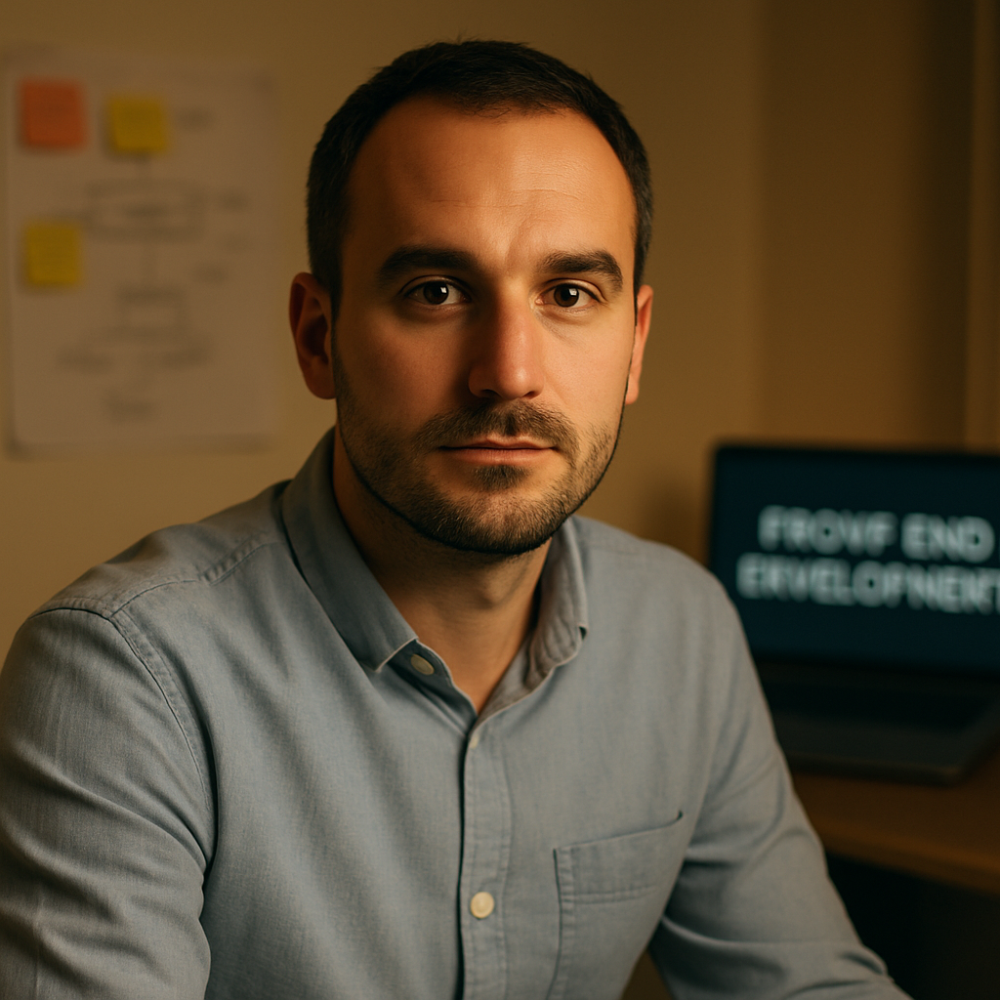

# Scholia

## Create User Personas  
|                                                           **Mia Novak (21)**                                                           |                                                         **Luka Marin (34)**                                                        |                                                            **Ana Kovač (28)**                                                            |
| :------------------------------------------------------------------------------------------------------------------------------------: | :--------------------------------------------------------------------------------------------------------------------------------: | :--------------------------------------------------------------------------------------------------------------------------------------: |
|                                                                                                 |                                                                                           |                                                                                                   |
|                                                  **Role** Undergraduate CS Student                                                  |                                   **Role** Career Switcher (Hospitality → Frontend Developer)                                   |                                           **Role** Working Professional (Product Marketing)                                           |
|                       **Primary Goals** • Build portfolio fast • Learn by doing • Find clear next steps                       |        **Primary Goals** • Land junior frontend role in 3–6 months • Track milestones • Earn certificates to share        |        **Primary Goals** • Apply new skills directly to work • Use ready-made templates • Learn in short focused sessions       |
|                         **Pain Points** • Bloated, long courses • Hidden costs • Confusing navigation                         |               **Pain Points** • Inconsistent quality • No clear learning roadmap • Lack of visible progress               |                 **Pain Points** • Overlong videos • Missing transcripts/resources • Poor mobile playback/resume                 |
| **Tech & Accessibility** • Android + 13" laptop • VS Code; Git basics • Needs transcripts/captions; studies in short sessions | **Tech & Accessibility** • iPhone + 15" Windows laptop • Git novice • Prefers large fonts and high contrast (night study) | **Tech & Accessibility** • MacBook Air + iPad • Uses transcripts at 1.25–1.5× speed • Values responsive playback across devices |

## Information Architecture
