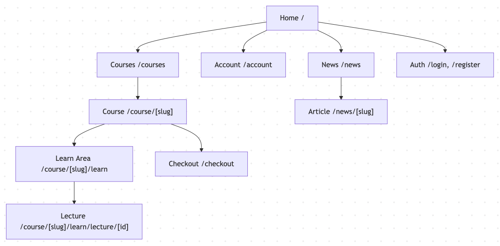

# Scholia

## User Personas  
|                                                           **Mia Novak (21)**                                                           |                                                         **Luka Marin (34)**                                                        |                                                            **Ana Kovač (28)**                                                            |
| :------------------------------------------------------------------------------------------------------------------------------------: | :--------------------------------------------------------------------------------------------------------------------------------: | :--------------------------------------------------------------------------------------------------------------------------------------: |
|                                                                                                 |                                                                                           |                                                                                                   |
|                                                  **Role** Undergraduate CS Student                                                  |                                   **Role** Career Switcher (Hospitality → Frontend Developer)                                   |                                           **Role** Working Professional (Product Marketing)                                           |
|                       **Primary Goals** • Build portfolio fast • Learn by doing • Find clear next steps                       |        **Primary Goals** • Land junior frontend role in 3–6 months • Track milestones • Earn certificates to share        |        **Primary Goals** • Apply new skills directly to work • Use ready-made templates • Learn in short focused sessions       |
|                         **Pain Points** • Bloated, long courses • Hidden costs • Confusing navigation                         |               **Pain Points** • Inconsistent quality • No clear learning roadmap • Lack of visible progress               |                 **Pain Points** • Overlong videos • Missing transcripts/resources • Poor mobile playback/resume                 |
| **Tech & Accessibility** • Android + 13" laptop • VS Code; Git basics • Needs transcripts/captions; studies in short sessions | **Tech & Accessibility** • iPhone + 15" Windows laptop • Git novice • Prefers large fonts and high contrast (night study) | **Tech & Accessibility** • MacBook Air + iPad • Uses transcripts at 1.25–1.5× speed • Values responsive playback across devices |

## Sitemap

## LLM Prompts
Based on already provided data about our new platform we are building, I need you to generate me 3 user personas. Act as an expert in UX field.

Based on already generated user personas, I need you to generate me an optimised prompt to generate the persona image, one per each. I am using Sora platform to generate images. 

Generate a single 1:1 still image (not video): a photorealistic editorial portrait of a Croatian woman in a modern office holding a tablet. Bright neutral lighting, eye-level, shallow depth of field; background suggests charts/dashboards softly blurred. Friendly, confident expression. Authentic skin texture, minimal retouching. No text, no watermarks, no logos. Camera look: 50mm f/2.2, ISO 250.

Generate a single 1:1 still image (not video): a photorealistic editorial portrait of a Croatian man learning front-end development at a home desk. Smart-casual shirt, sticky notes and a laptop visible in the softly blurred background. Evening warm indoor light, eye-level, shallow depth of field. Calm, confident expression. Authentic look, minimal retouching. No text, no watermarks, no logos. Camera look: 50mm f/2.0, ISO 400. Background hints of a learning roadmap on the wall, softly out of focus.

Generate a single 1:1 still image (not video): a photorealistic editorial portrait of a young Croatian woman studying in a dorm. Casual hoodie, seated at a small desk with a laptop and notebook slightly out of focus. Soft natural window light, eye-level framing, shallow depth of field, neutral warm tones. Authentic, minimal retouching. No text, no watermarks, no logos. Camera look: 50mm f/1.8, ISO 200. Background: minimalist dorm details subtly blurred. Expression: neutral with a slight smile.

Guide me through the sitemap architecture Udemy uses.
